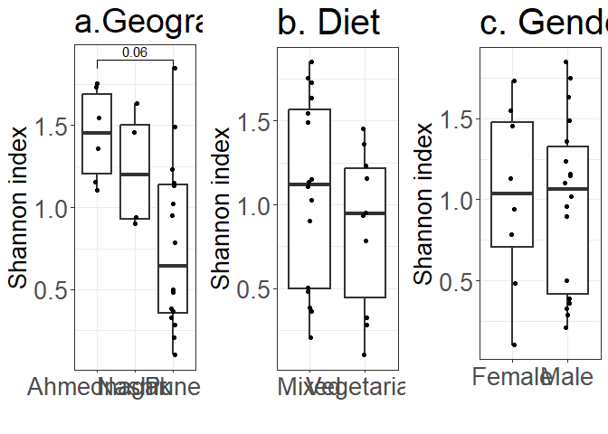

\##updated analysis of alpha diversity with niter

    ##                  Diet Geographical_location                Gender 
    ##            0.40257244            0.06523656            0.95569587

