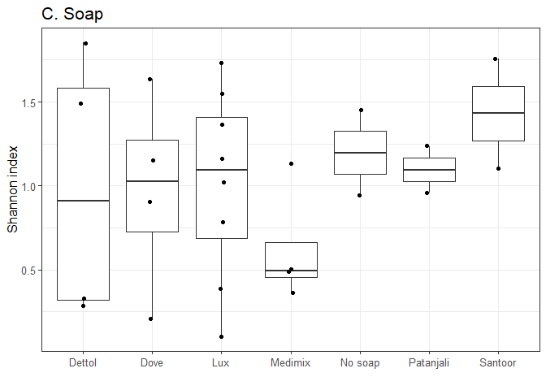

    library("mia")
    tse <- readRDS("data/twins_tse.rds")
    #Alpha diversity measures
    tse <- mia::estimateDiversity(tse, 
                                  assay_name = "counts",
                                  index = "shannon", 
                                  name = "shannon")
    head(colData(tse)$shannon)

    ##      T1A      T1B      T2A      T2B      T3A      T3B 
    ## 1.159530 1.362083 0.483658 1.134799 1.734696 1.549655

    library(ggplot2)
    library(patchwork)
    library(ggsignif)

    df <- as.data.frame(colData(tse))
    a <- ggplot(df, aes(x = Diet, y = shannon)) +    ## Shannon Diversity for Diet
    geom_boxplot(outlier.shape = NA) + 
      geom_jitter(width = 0.05) + 
      labs(y= "Shannon index", x= "", title = "A. Diet") + theme_bw() + theme(text = element_text(size = 13), axis.text = element_text(size = 10), axis.title = element_text(size = 12)) + geom_signif(comparisons = list(c("Mixed", "Vegetarian")), map_signif_level = FALSE, na.rm = TRUE)
      
    b <- ggplot(df, aes(x = Gender, y = shannon)) +    ## Shannon Diversity for Gender
    geom_boxplot(outlier.shape = NA) + 
      geom_jitter(width = 0.05) + 
      labs(y= "Shannon index", x= "", title = "B. Gender") + theme_bw() + theme(text = element_text(size = 13), axis.text = element_text(size = 10), axis.title = element_text(size = 12)) + geom_signif(comparisons = list(c("Male", "Female")), map_signif_level = FALSE, na.rm = TRUE)

    d <- ggplot(df, aes(x = Geographical_location, y = shannon)) +    ## Shannon Diversity for location
    geom_boxplot(outlier.shape = NA) + 
      geom_jitter(width = 0.05) + 
      labs(y= "Shannon index", x= "", title = "C. Geographical location") + theme_bw() + theme(text = element_text(size = 13), axis.text = element_text(size = 10), axis.title = element_text(size = 12)) + geom_signif(comparisons = list(c("Ahmednagar", "Pune"), c("Pune","Nashik"), c("Nashik", "Ahmednagar")), map_signif_level = FALSE, na.rm = TRUE)

    ## Multiple pairwise comparison for all co-factors
    m <- c()
    l <- df
    m[["Diet"]] <- kruskal.test(data = l, shannon ~ factor(Diet))$p.value
    m[["Geographical_location"]] <- kruskal.test(data = l, shannon ~ factor(Geographical_location))$p.value
    m[["Gender"]] <- kruskal.test(data = l, shannon ~ factor(Gender))$p.value
    p.adjust(m, method="fdr")

    ##                  Diet Geographical_location                Gender 
    ##            0.40257244            0.06523656            0.95569587

    c <- ggplot(df, aes(x = Soap, y = shannon)) +    ## Shannon Diversity for location
    geom_boxplot(outlier.shape = NA) + 
      geom_jitter(width = 0.05) + 
      labs(y= "Shannon index", x= "", title = "C. Soap") + theme_bw() + theme(text = element_text(size = 13), axis.text = element_text(size = 10), axis.title = element_text(size = 12)) #+ geom_signif(comparisons = list(c("Ahmednagar", "Pune"), c("Pune","Nashik"), c("Nashik", "Ahmednagar")), map_signif_level = FALSE, na.rm = TRUE)

    print(c)

    a <- ggplot(df, aes(x = Pair, y = shannon)) +    ## Shannon Diversity for Diet
    geom_boxplot(outlier.shape = NA) + 
      geom_jitter(width = 0.05) + 
      labs(y= "Shannon index", x= "", title = "Twin-pair diversity") + theme_bw() + theme(text = element_text(size = 13), axis.text = element_text(size = 10), axis.title = element_text(size = 12)) + geom_signif(comparisons = list(c("Twin1", "Twin2"), c("Twin1", "Twin9"), c("Twin3", "Twin4")), map_signif_level = FALSE, na.rm = TRUE)

    ## anosim
    df <- as.data.frame(colData(tse))
    library(vegan)
    df <- as.data.frame(colData(tse))
    s <- anosim(df$shannon, df$Pair, permutations = 999)
    summary(s)

    ## 
    ## Call:
    ## anosim(x = df$shannon, grouping = df$Pair, permutations = 999) 
    ## Dissimilarity: bray 
    ## 
    ## ANOSIM statistic R: 0.1617 
    ##       Significance: 0.103 
    ## 
    ## Permutation: free
    ## Number of permutations: 999
    ## 
    ## Upper quantiles of permutations (null model):
    ##   90%   95% 97.5%   99% 
    ## 0.163 0.223 0.268 0.318 
    ## 
    ## Dissimilarity ranks between and within classes:
    ##          0%   25%   50%    75% 100%   N
    ## Between   1  83.5 165.5 245.25  325 312
    ## Twin1    46  46.0  46.0  46.00   46   1
    ## Twin10  135 135.0 135.0 135.00  135   1
    ## Twin11  292 292.0 292.0 292.00  292   1
    ## Twin12  159 159.0 159.0 159.00  159   1
    ## Twin13  129 129.0 129.0 129.00  129   1
    ## Twin2   192 192.0 192.0 192.00  192   1
    ## Twin3    34  34.0  34.0  34.00   34   1
    ## Twin4   304 304.0 304.0 304.00  304   1
    ## Twin5   101 101.0 101.0 101.00  101   1
    ## Twin6    42  42.0  42.0  42.00   42   1
    ## Twin7    83  83.0  83.0  83.00   83   1
    ## Twin8    69  69.0  69.0  69.00   69   1
    ## Twin9   205 205.0 205.0 205.00  205   1

    plot(s)

