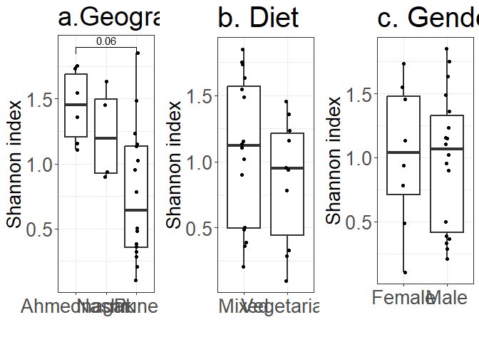

    ## [1] 1.159530 1.362083 0.483658 1.134799 1.734696 1.549655

    ##                  Diet Geographical_location                Gender 
    ##            0.40257244            0.06523656            0.95569587

    ## 
    ## Call:
    ## anosim(x = df$shannon, grouping = df$Pair, permutations = 999) 
    ## Dissimilarity: bray 
    ## 
    ## ANOSIM statistic R: 0.1617 
    ##       Significance: 0.102 
    ## 
    ## Permutation: free
    ## Number of permutations: 999
    ## 
    ## Upper quantiles of permutations (null model):
    ##   90%   95% 97.5%   99% 
    ## 0.163 0.217 0.262 0.325 
    ## 
    ## Dissimilarity ranks between and within classes:
    ##          0%   25%   50%    75% 100%   N
    ## Between   1  83.5 165.5 245.25  325 312
    ## Twin1    46  46.0  46.0  46.00   46   1
    ## Twin10  135 135.0 135.0 135.00  135   1
    ## Twin11  292 292.0 292.0 292.00  292   1
    ## Twin12  159 159.0 159.0 159.00  159   1
    ## Twin13  129 129.0 129.0 129.00  129   1
    ## Twin2   192 192.0 192.0 192.00  192   1
    ## Twin3    34  34.0  34.0  34.00   34   1
    ## Twin4   304 304.0 304.0 304.00  304   1
    ## Twin5   101 101.0 101.0 101.00  101   1
    ## Twin6    42  42.0  42.0  42.00   42   1
    ## Twin7    83  83.0  83.0  83.00   83   1
    ## Twin8    69  69.0  69.0  69.00   69   1
    ## Twin9   205 205.0 205.0 205.00  205   1

# Alpha diversity at phyla level\_just for checking 2 dec2024

    ## [1] 0.3212434 0.4817252 0.1309441 0.4973243 0.6868667 0.8289948

    ##                  Diet Geographical_location                Gender 
    ##            0.30885482            0.04602548            0.82414090

 \##updated analysis
of alpha diversity with niter

    ##                  Diet Geographical_location                Gender 
    ##            0.40257244            0.06523656            0.95569587

