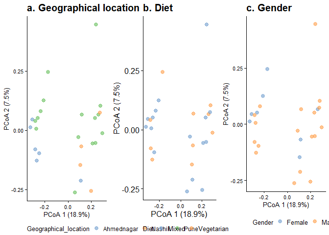

    ## Permutation test for adonis under reduced model
    ## Marginal effects of terms
    ## Permutation: free
    ## Number of permutations: 999
    ## 
    ## adonis2(formula = t(assay(tse, "relabundance")) ~ Geographical_location + Diet + Gender, data = colData(tse), permutations = 999, method = "bray", by = "margin")
    ##                       Df SumOfSqs      R2      F Pr(>F)   
    ## Geographical_location  2   1.3191 0.24276 3.5939  0.003 **
    ## Diet                   1   0.1579 0.02906 0.8606  0.543   
    ## Gender                 1   0.1401 0.02578 0.7634  0.574   
    ## Residual              21   3.8539 0.70924                 
    ## Total                 25   5.4338 1.00000                 
    ## ---
    ## Signif. codes:  0 '***' 0.001 '**' 0.01 '*' 0.05 '.' 0.1 ' ' 1

# Jaccard

    ## Permutation test for adonis under reduced model
    ## Marginal effects of terms
    ## Permutation: free
    ## Number of permutations: 999
    ## 
    ## adonis2(formula = t(assay(tse, "pa")) ~ Geographical_location + Diet + Gender, data = colData(tse), permutations = 999, method = "jaccard", by = "margin")
    ##                       Df SumOfSqs      R2      F Pr(>F)    
    ## Geographical_location  2   0.9800 0.13609 1.8236  0.001 ***
    ## Diet                   1   0.2343 0.03253 0.8719  0.713    
    ## Gender                 1   0.3588 0.04983 1.3354  0.092 .  
    ## Residual              21   5.6429 0.78360                  
    ## Total                 25   7.2013 1.00000                  
    ## ---
    ## Signif. codes:  0 '***' 0.001 '**' 0.01 '*' 0.05 '.' 0.1 ' ' 1

\#PCoA

# Aitchison

    ## Permutation test for adonis under reduced model
    ## Marginal effects of terms
    ## Permutation: free
    ## Number of permutations: 999
    ## 
    ## adonis2(formula = t(assay(tse, "clr")) ~ Geographical_location + Diet + Gender, data = colData(tse), permutations = 999, method = "euclidean", by = "margin")
    ##                       Df SumOfSqs      R2      F Pr(>F)    
    ## Geographical_location  2   1473.3 0.16639 2.3723  0.001 ***
    ## Diet                   1    395.9 0.04471 1.2749  0.145    
    ## Gender                 1    556.7 0.06287 1.7926  0.015 *  
    ## Residual              21   6521.1 0.73647                  
    ## Total                 25   8854.6 1.00000                  
    ## ---
    ## Signif. codes:  0 '***' 0.001 '**' 0.01 '*' 0.05 '.' 0.1 ' ' 1

