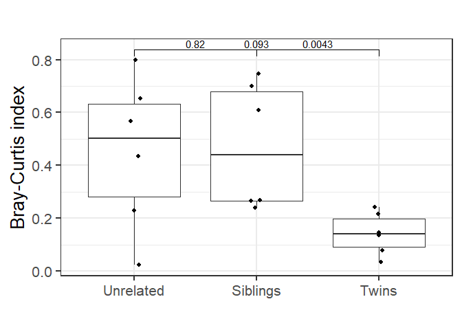
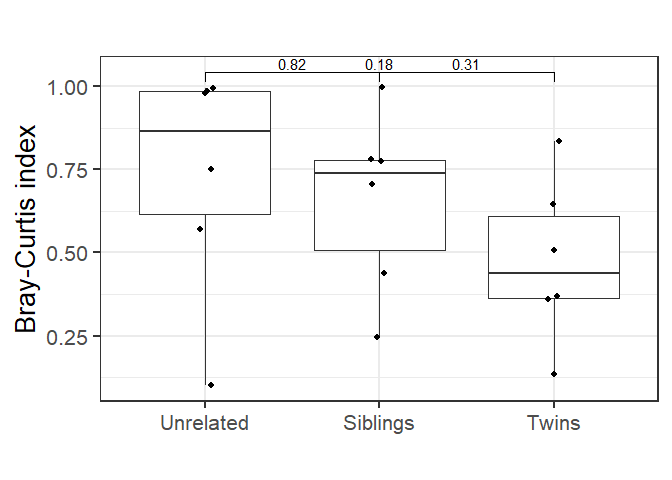
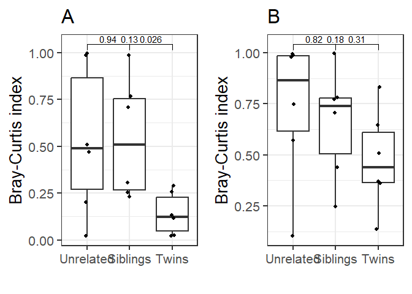
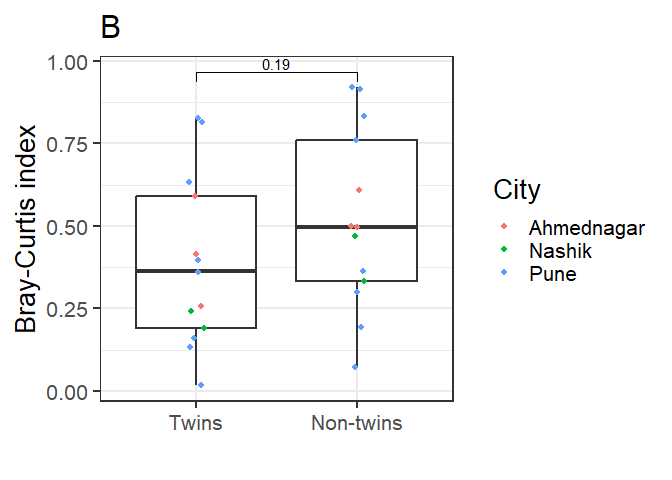
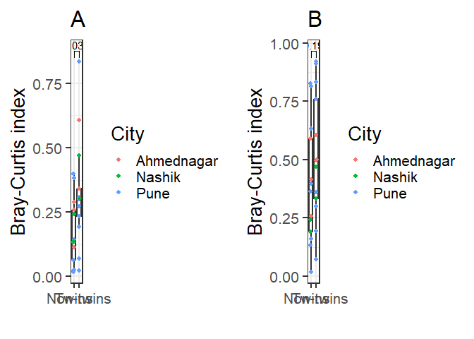

# Comparative analysis between Twins, siblings and unrelated pairs at phylum level (rarefraction)

    ## [1] 10.88816

    ## [1] 10.88816

# Comparative analysis between Twins and Non-twin (rarefraction)

    ## [1] 2.607082

    ## [1] 2.607082

