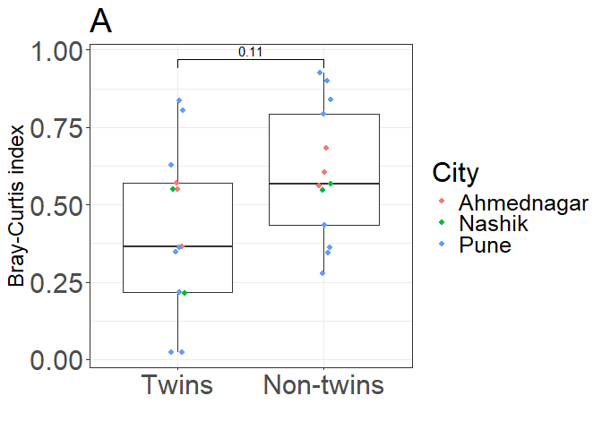
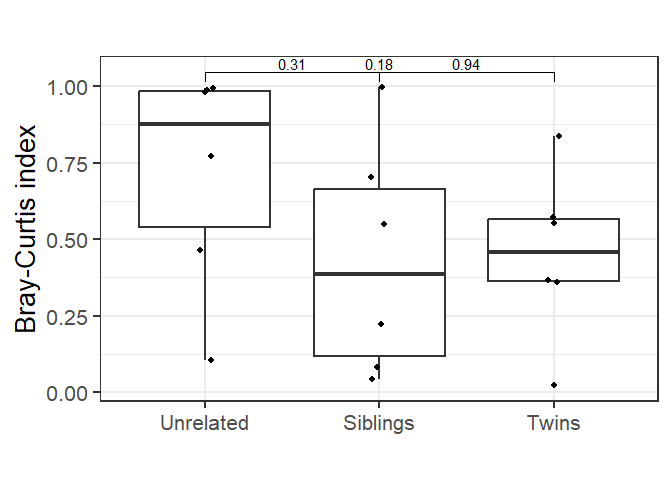
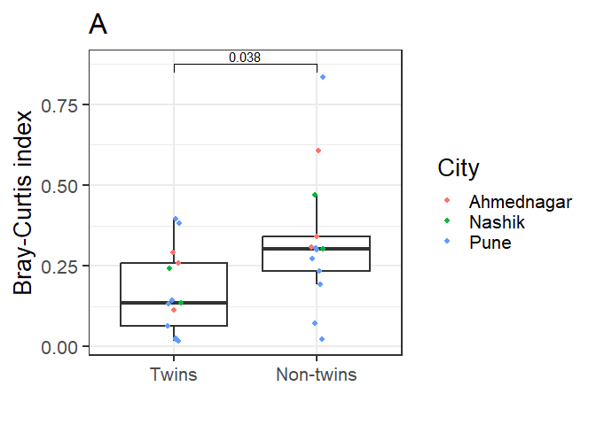
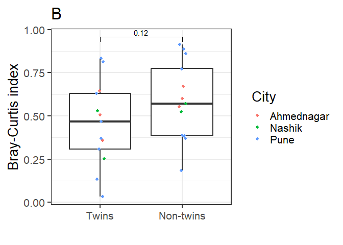
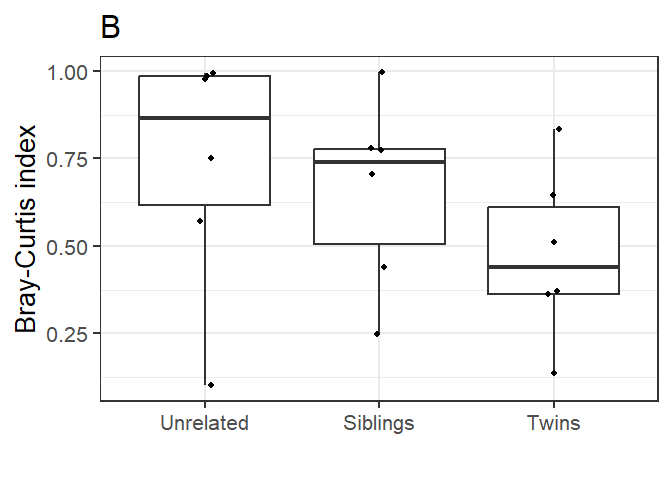
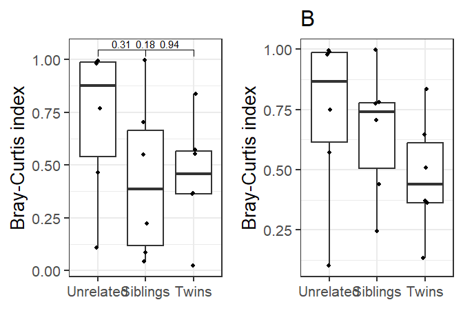

working twins vr non-twins

\###not considered for publication###

\##working## \# Comparative analysis between Twins, siblings and
unrelated pairs at phylum level (rarefraction)

# Comparative analysis between Twins and Non-twin (rarefraction)

# Comparative analysis between Twins and Non-twin (niter)……..final

# Feb 2025 Comparative analysis between Twins, siblings and unrelated pairs at phylum level (rarefraction)

    ## [1] 10.88816

