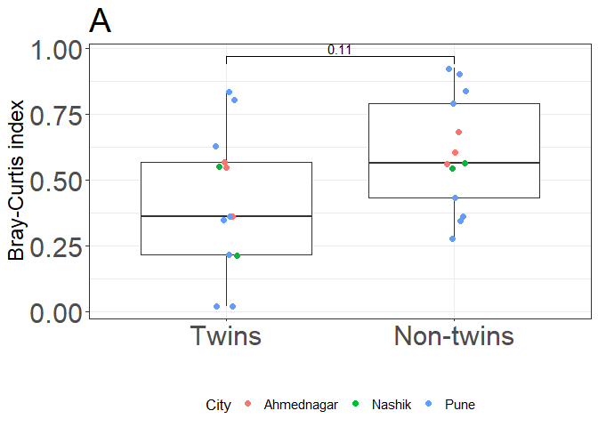
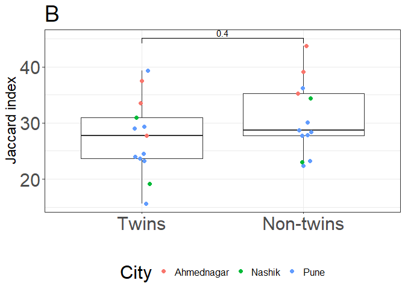
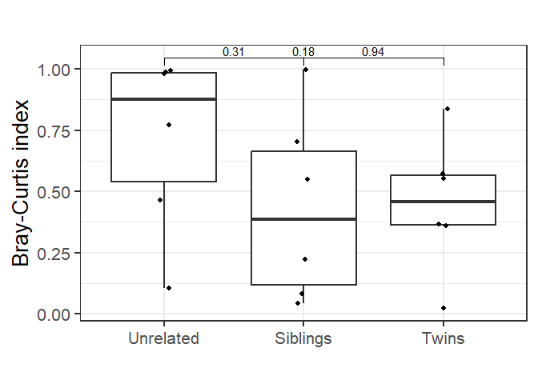
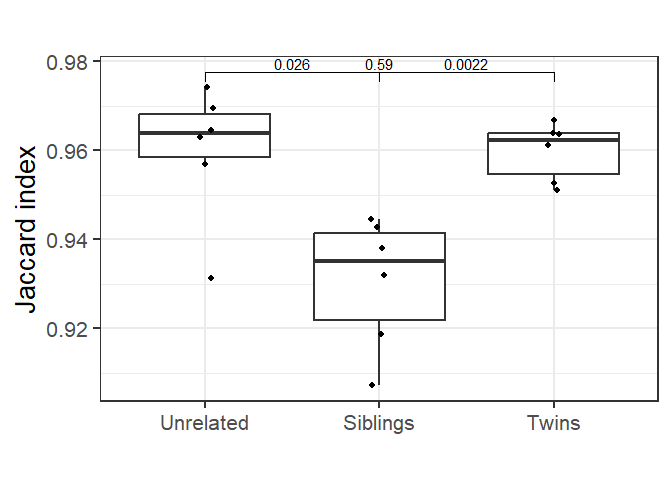

## twins vs non-twin comparison using Bray-curtise index

## twins vs non-twin comparison using jaccard index

## twins vs sib vs unrelated individual comparison using Bray-Curtise index

## twins vs sib vs unrelated individual comparison using jaccard index

