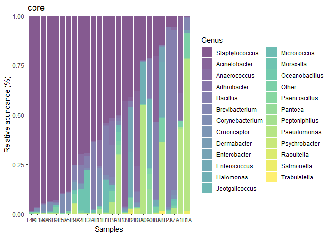
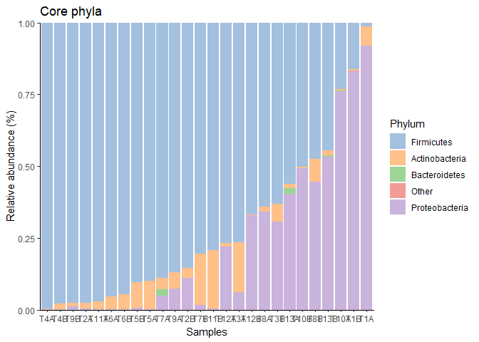
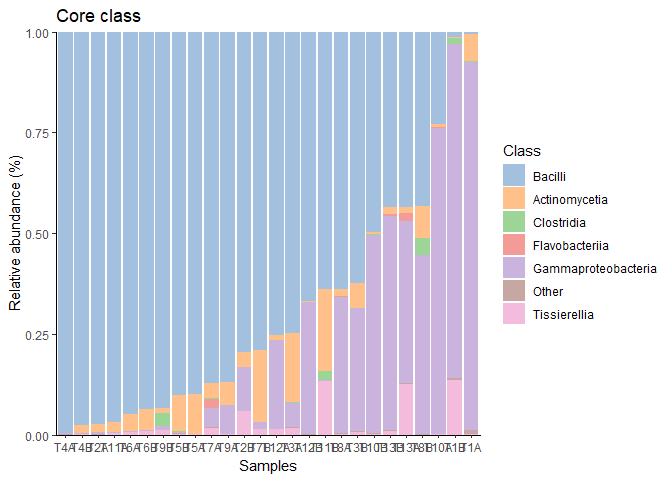
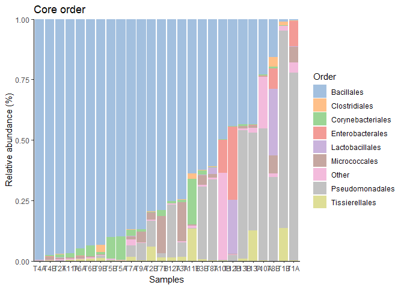
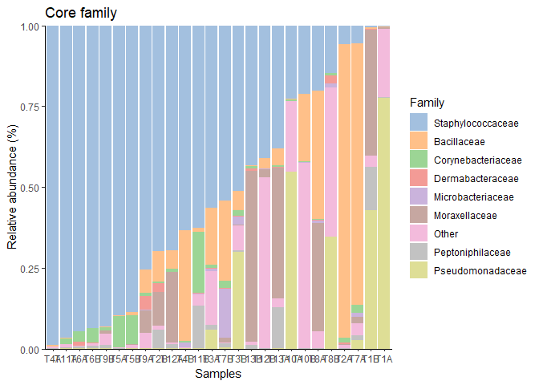

## all data

## Most prevelent genera

    ## DataFrame with 6 rows and 8 columns
    ##                     Kingdom         Phylum               Class             Order             Family           Genus
    ##                 <character>    <character>         <character>       <character>        <character>     <character>
    ## Staphylococcus     Bacteria     Firmicutes             Bacilli        Bacillales  Staphylococcaceae  Staphylococcus
    ## Bacillus           Bacteria     Firmicutes             Bacilli        Bacillales        Bacillaceae        Bacillus
    ## Corynebacterium    Bacteria Actinobacteria       Actinomycetia Corynebacteriales Corynebacteriaceae Corynebacterium
    ## Anaerococcus       Bacteria     Firmicutes        Tissierellia    Tissierellales   Peptoniphilaceae    Anaerococcus
    ## Pseudomonas        Bacteria Proteobacteria Gammaproteobacteria   Pseudomonadales   Pseudomonadaceae     Pseudomonas
    ## Micrococcus        Bacteria Actinobacteria       Actinomycetia     Micrococcales  Microbacteriaceae     Micrococcus
    ##                       mean      median
    ##                  <numeric>   <numeric>
    ## Staphylococcus  0.52503637 0.529249567
    ## Bacillus        0.13138500 0.014524240
    ## Corynebacterium 0.02413780 0.009713417
    ## Anaerococcus    0.02166092 0.004639319
    ## Pseudomonas     0.09559647 0.000659545
    ## Micrococcus     0.00893558 0.000391056

    ##  Staphylococcus Corynebacterium        Bacillus    Anaerococcus     Pseudomonas     Micrococcus 
    ##       1.0000000       0.8461538       0.8461538       0.6923077       0.3846154       0.3846154

## Most prevelent phyla

    ## DataFrame with 3 rows and 8 columns
    ##                    Kingdom         Phylum       Class       Order      Family       Genus      mean    median
    ##                <character>    <character> <character> <character> <character> <character> <numeric> <numeric>
    ## Firmicutes        Bacteria     Firmicutes          NA          NA          NA          NA 0.7183525 0.7990028
    ## Proteobacteria    Bacteria Proteobacteria          NA          NA          NA          NA 0.2280329 0.0670659
    ## Actinobacteria    Bacteria Actinobacteria          NA          NA          NA          NA 0.0514973 0.0303059

    ##        Actinobacteria            Firmicutes        Proteobacteria         Bacteroidetes Thermodesulfobacteria 
    ##             1.0000000             1.0000000             0.9615385             0.1153846             0.0000000 
    ##   Gammaproteobacteria 
    ##             0.0000000

mams cut off

    library(mia)
    library(miaViz)
    library(dplyr)
    tse <- readRDS("data/twins_tse.rds")
    tse <- relAbundanceCounts(tse)
    tse_Genus <- agglomerateByRank(tse, rank ="Genus", onRankOnly=TRUE)
    top_taxa <- getTopTaxa(tse_Genus,top =24, detection = 0.8/100, prevalence = 26.9/100, method = "prevalence", assay_name = "relabundance")
    Genus_renamed <- lapply(rowData(tse)$Genus,
                       function(x){if (x %in% top_taxa) {x} else {"Other"}})
    rowData(tse)$Genus <- as.character(Genus_renamed)

    merged <- mergeCols(tse, colData(tse)$Samples)
    merged1 <- transformCounts(merged, abund_values = "counts",
                                  method = "relabundance")

    a <- plotAbundance(merged, assay_name="relabundance", rank = "Genus",
                  #order_rank_by="abund", 
                  order_sample_by = "Staphylococcus", add_x_text = TRUE)+ labs(x = "Samples", y = "Relative abundance (%)", title = "core")
    print(a)

    ###core phyla
    tse <- readRDS("data/twins_tse.rds")
    tse <- relAbundanceCounts(tse)
    tse_Phyla <- agglomerateByRank(tse, rank ="Phylum", onRankOnly=TRUE)
    top_taxa <- getTopTaxa(tse_Phyla,top =4, detection = 0.8/100, prevalence = 26.9/100, method = "prevalence", assay_name = "relabundance")
    Phyla_renamed <- lapply(rowData(tse)$Phylum,
                       function(x){if (x %in% top_taxa) {x} else {"Other"}})
    rowData(tse)$Phylum <- as.character(Phyla_renamed)

    merged <- mergeCols(tse, colData(tse)$Samples)
    merged1 <- transformCounts(merged, abund_values = "counts",
                                  method = "relabundance")

    a <- plotAbundance(merged, assay_name="relabundance", rank = "Phylum",
                  #order_rank_by="abund", 
                  order_sample_by = "Firmicutes", add_x_text = TRUE)+ labs(x = "Samples", y = "Relative abundance (%)", title = "Core phyla")
    print(a)

    ###core class
    tse <- readRDS("data/twins_tse.rds")
    tse <- relAbundanceCounts(tse)
    tse_Class <- agglomerateByRank(tse, rank ="Class", onRankOnly=TRUE)
    top_taxa <- getTopTaxa(tse_Class,top =6, detection = 0.8/100, prevalence = 26.9/100, method = "prevalence", assay_name = "relabundance")
    Class_renamed <- lapply(rowData(tse)$Class,
                       function(x){if (x %in% top_taxa) {x} else {"Other"}})
    rowData(tse)$Class <- as.character(Class_renamed)

    merged <- mergeCols(tse, colData(tse)$Samples)
    merged1 <- transformCounts(merged, abund_values = "counts",
                                  method = "relabundance")

    a <- plotAbundance(merged, assay_name="relabundance", rank = "Class",
                  #order_rank_by="abund", 
                  order_sample_by = "Bacilli", add_x_text = TRUE)+ labs(x = "Samples", y = "Relative abundance (%)", title = "Core class")
    print(a)

    ###core order
    tse <- readRDS("data/twins_tse.rds")
    tse <- relAbundanceCounts(tse)
    tse_Order <- agglomerateByRank(tse, rank ="Order", onRankOnly=TRUE)
    top_taxa <- getTopTaxa(tse_Order,top =8, detection = 0.8/100, prevalence = 26.9/100, method = "prevalence", assay_name = "relabundance")
    Order_renamed <- lapply(rowData(tse)$Order,
                       function(x){if (x %in% top_taxa) {x} else {"Other"}})
    rowData(tse)$Order <- as.character(Order_renamed)

    merged <- mergeCols(tse, colData(tse)$Samples)
    merged1 <- transformCounts(merged, abund_values = "counts",
                                  method = "relabundance")

    a <- plotAbundance(merged, assay_name="relabundance", rank = "Order",
                  #order_rank_by="abund", 
                  order_sample_by = "Bacillales", add_x_text = TRUE)+ labs(x = "Samples", y = "Relative abundance (%)", title = "Core order")
    print(a)

    ###core family
    tse <- readRDS("data/twins_tse.rds")
    tse <- relAbundanceCounts(tse)
    tse_Family<- agglomerateByRank(tse, rank ="Family", onRankOnly=TRUE)
    top_taxa <- getTopTaxa(tse_Family,top =8, detection = 0.8/100, prevalence = 26.9/100, method = "prevalence", assay_name = "relabundance")
    Family_renamed <- lapply(rowData(tse)$Family,
                       function(x){if (x %in% top_taxa) {x} else {"Other"}})
    rowData(tse)$Family <- as.character(Family_renamed)

    merged <- mergeCols(tse, colData(tse)$Samples)
    merged1 <- transformCounts(merged, abund_values = "counts",
                                  method = "relabundance")

    a <- plotAbundance(merged, assay_name="relabundance", rank = "Family",
                  #order_rank_by="abund", 
                  order_sample_by = "Staphylococcaceae", add_x_text = TRUE)+ labs(x = "Samples", y = "Relative abundance (%)", title = "Core family")
    print(a)

