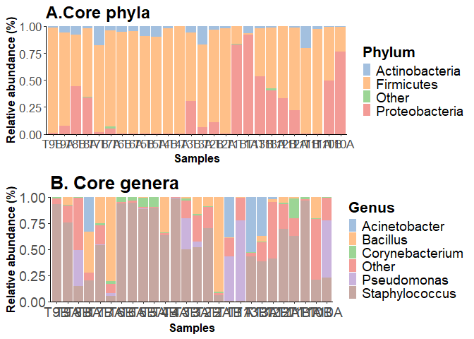

    ## Warning in toTree(td): The root is added with label 'ALL'

## Most prevelent genera mean, median calculations

    ## Warning: '.local' is deprecated.
    ## Use 'transformAssay' instead.
    ## See help("Deprecated")

    ## DataFrame with 6 rows and 8 columns
    ##                     Kingdom         Phylum               Class             Order             Family           Genus
    ##                 <character>    <character>         <character>       <character>        <character>     <character>
    ## Staphylococcus     Bacteria     Firmicutes             Bacilli        Bacillales  Staphylococcaceae  Staphylococcus
    ## Bacillus           Bacteria     Firmicutes             Bacilli        Bacillales        Bacillaceae        Bacillus
    ## Corynebacterium    Bacteria Actinobacteria       Actinomycetia Corynebacteriales Corynebacteriaceae Corynebacterium
    ## Anaerococcus       Bacteria     Firmicutes        Tissierellia    Tissierellales   Peptoniphilaceae    Anaerococcus
    ## Pseudomonas        Bacteria Proteobacteria Gammaproteobacteria   Pseudomonadales   Pseudomonadaceae     Pseudomonas
    ## Micrococcus        Bacteria Actinobacteria       Actinomycetia     Micrococcales  Microbacteriaceae     Micrococcus
    ##                       mean      median
    ##                  <numeric>   <numeric>
    ## Staphylococcus  0.52503637 0.529249567
    ## Bacillus        0.13138500 0.014524240
    ## Corynebacterium 0.02413780 0.009713417
    ## Anaerococcus    0.02166092 0.004639319
    ## Pseudomonas     0.09559647 0.000659545
    ## Micrococcus     0.00893558 0.000391056

    ##  Staphylococcus     Pseudomonas        Bacillus    Anaerococcus Corynebacterium   Acinetobacter 
    ##       1.0000000       1.0000000       1.0000000       1.0000000       0.9615385       0.8461538
